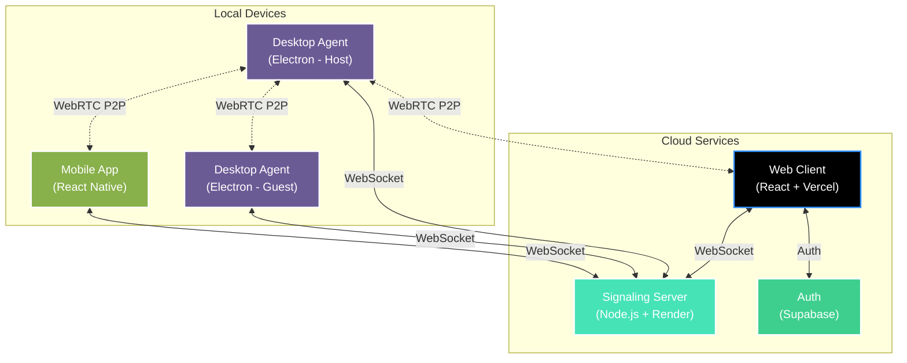

<div align="center">

# ⚡ SuperDesk

### Modern Remote Desktop Access for the Web Era

[](https://render.com)
[](https://vercel.com)
[](LICENSE)
[](https://nodejs.org)

<p>
  
</p>

**Real-time screen sharing • Remote control • P2P file transfer • Cross-platform**

[🚀 Get Started](#-quick-start) · [📖 Documentation](#-usage) · [🏗️ Architecture](#-architecture) · [📱 Mobile App](https://github.com/neeer4j/SuperDesk-Mobile)

</div>

---

## ✨ Features

<table>
<tr>
<td width="50%">

### 🖥️ Remote Desktop
- **Real-time Screen Sharing** with WebRTC
- **Full Remote Control** via WebRTC DataChannels – Mouse & keyboard
- **Multi-monitor Support** – Choose which screen to share
- **Adaptive Quality** – Auto-adjusts based on network

</td>
<td width="50%">

### 📂 File Transfer
- **P2P Direct Transfer** via WebRTC DataChannel
- **Up to 20GB** per file (configurable)
- **Progress Tracking** with real-time status
- **No Server Relay** – Files never touch the cloud

</td>
</tr>
<tr>
<td width="50%">

### 👥 Social Features
- **Friends System** – Add and manage contacts
- **Real-time Chat** – Message during sessions
- **Session History** – Track past connections
- **Secure Auth** – Email OTP via Supabase

</td>
<td width="50%">

### 🎨 Experience
- **Light/Dark Themes** – System-aware
- **8-Character Session IDs** – Easy to share
- **Cross-Platform** – Windows, Web, Android
- **End-to-End Encryption** – DTLS-SRTP

</td>
</tr>
</table>

---

## 🏗️ Architecture



| Component | Description | Hosted On |
|:----------|:------------|:---------:|
| **Web Client** | React app for browser-based session joining |  |
| **Signaling Server** | Node.js backend for WebRTC signaling & sessions |  |
| **Auth (Supabase)** | Email OTP authentication and user management |  |
| **Desktop Agent** | Electron app for Windows (host or join) | 💻 Local |
| **Mobile App** | React Native app for Android/iOS | 📱 Local |

---

## 🚀 Quick Start

### Prerequisites

| Requirement | Version |
|-------------|---------|
| Node.js | 18+ |
| Windows | 10/11 (for Desktop Agent) |
| Browser | Chrome, Edge, Firefox (WebRTC support) |

### Development Setup

```bash
# Clone the repository
git clone https://github.com/neeer4j/SuperDesk.git
cd SuperDesk

# Install all dependencies
npm run install:all

# Start development (server + client)
npm run dev
```

> **Note:** Server runs on `localhost:3001`, client on `localhost:3000`

### Running the Desktop Agent

```bash
cd agent
npm install
npm start
```

---

## 📖 Usage

<details>
<summary><b>🖥️ Host a Session</b></summary>

1. Open the **Desktop Agent** and sign in
2. Click **Share** and select a screen/window
3. Share the **8-character Session ID** with others

</details>

<details>
<summary><b>🔗 Join a Session</b></summary>

- **Desktop Agent**: Enter the Session ID → Click **Join**
- **Web Client**: Navigate to the web app → Enter Session ID
- **Mobile App**: Open app → Enter Session ID → Connect

</details>

<details>
<summary><b>📂 Transfer Files</b></summary>

1. During an active session, the **File Transfer** card appears
2. Drag & drop files or click to select
3. Guest receives a file offer (Accept/Reject)
4. Transfer happens directly P2P with progress indicators

</details>

---

## ⚙️ Configuration

### Environment Variables

Create a `.env` file in the `server/` directory:

```env
PORT=8080
NODE_ENV=production

# Cloudflare TURN for NAT traversal (recommended for production)
CLOUDFLARE_TURN_KEY_ID=your_key_id
CLOUDFLARE_TURN_KEY_API_TOKEN=your_api_token

# Alternative: Static TURN configuration
# TURN_URLS=turn:your-turn-server.com:3478
# TURN_USERNAME=your_username
# TURN_CREDENTIAL=your_password
```

### File Transfer Limits

Modify in `shared/index.js`:

```javascript
const FILE_TRANSFER = {
  MAX_SIZE: 20 * 1024 * 1024 * 1024, // 20GB
  CHUNK_SIZE: 16 * 1024              // 16KB chunks
};
```

---

## 🚢 Deployment

| Component | Platform | Trigger |
|-----------|----------|---------|
| **Signaling Server** | [Render](https://render.com) | Auto-deploy on `main` push |
| **Web Client** | [Vercel](https://vercel.com) | Auto-deploy on `main` push |

### Server → Render

1. Go to [dashboard.render.com](https://dashboard.render.com) → **New → Web Service**
2. Connect your GitHub repo
3. Render auto-detects `render.yaml` — no manual config needed
4. Add these environment variables in the Render dashboard:

| Variable | Value |
|----------|-------|
| `NODE_ENV` | `production` |
| `PORT` | `10000` |
| `CLIENT_URL` | `https://your-app.vercel.app` |
| `CLOUDFLARE_TURN_KEY_ID` | *(optional, for TURN)* |
| `CLOUDFLARE_TURN_KEY_API_TOKEN` | *(optional, for TURN)* |

> Live server: **https://superdesk-7m7f.onrender.com**  
> Keep it awake for free with [UptimeRobot](https://uptimerobot.com) — ping `/health` every 5 min.

### Client → Vercel

1. Import the repo in [vercel.com](https://vercel.com), set **Root Directory** to `client`
2. Add one environment variable:

| Variable | Value |
|----------|-------|
| `REACT_APP_SERVER_URL` | `https://superdesk-7m7f.onrender.com` |

> Also add `REACT_APP_SERVER_URL` as a **GitHub Actions secret** so CI builds succeed.

### GitHub Actions secrets required

| Secret | Used by |
|--------|---------|
| `REACT_APP_SERVER_URL` | `deploy.yml` client build |

---

## 📁 Project Structure

```
SuperDesk/
├── 📂 client/          # React web application (Vercel)
├── 📂 server/          # Node.js signaling server (Render)
├── 📂 agent/           # Electron desktop agent
│   └── 📂 modules/     # Agent modules (file-transfer, webrtc)
└── 📂 shared/          # Shared constants and utilities
```

---

## 🔐 Security

| Feature | Implementation |
|---------|----------------|
| **Stream Encryption** | DTLS-SRTP (WebRTC standard) |
| **Signaling** | WSS (WebSocket Secure) |
| **Session IDs** | Ephemeral, randomly generated |
| **File Transfer** | P2P only – never touches server |
| **Authentication** | Supabase Email OTP |

---

## 🐛 Troubleshooting

<details>
<summary><b>Connection Issues</b></summary>

- Verify server is running and accessible
- Check firewall allows WebRTC traffic (UDP ports)
- Ensure both parties have stable network
- Check Render dashboard logs for server errors

</details>

<details>
<summary><b>File Transfer Issues</b></summary>

- Check DevTools console for `📁` prefixed logs
- Verify file size is under the configured limit
- Both agents must have the DataChannel established
- Try reconnecting the session

</details>

---

## 📄 License

This project is licensed under the **Apache License 2.0**.

See the [LICENSE](LICENSE) file for details.

---

<div align="center">

**⚡ SuperDesk** – Modern remote desktop access built with web technologies.

Made with ❤️ by [neeer4j](https://github.com/neeer4j) & [Joniyal](https://github.com/Joniyal)

</div>
